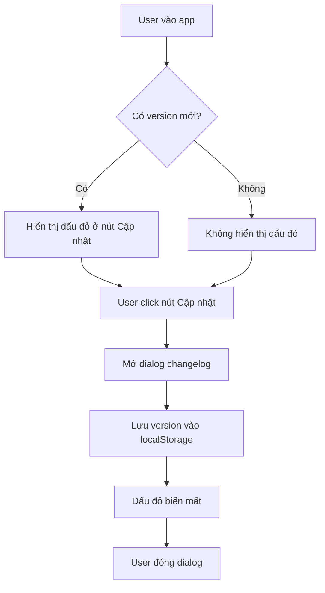

# 📢 Tính năng Thông báo Cập nhật (Changelog)

## 📋 Tổng quan

Hệ thống thông báo cập nhật giúp người dùng biết được những tính năng mới, cải tiến và sửa lỗi trong mỗi phiên bản của ứng dụng.

## 🎯 Tính năng chính

### 1. **Nút "Cập nhật" trên Header**

- Vị trí: Header chính của ứng dụng
- Hiển thị dấu chấm đỏ khi có update mới
- Click để xem chi tiết changelog

### 2. **Dialog Changelog**

- Hiển thị danh sách tất cả các update
- Phân loại theo type (Feature, Bugfix, Release, Improvement)
- Hiển thị version, ngày cập nhật
- Badge "Mới nhất" cho update gần nhất

### 3. **LocalStorage Tracking**

- Lưu version đã xem vào localStorage
- Tự động hiển thị dấu đỏ khi có version mới
- Dấu đỏ biến mất sau khi user đã xem

## 🗂️ Cấu trúc File

```
puzzle-level-generator-tool/
├── public/
│   └── changelog.json              # File JSON chứa dữ liệu changelog
├── src/
│   ├── components/
│   │   └── changelog-dialog.tsx    # Component dialog hiển thị changelog
│   ├── types/
│   │   └── changelog.types.ts      # TypeScript types cho changelog
│   └── ...
├── docs/
│   ├── CHANGELOG_FEATURE.md        # Tài liệu này
│   └── UPDATE_CHANGELOG.md         # Hướng dẫn cập nhật changelog
```

## 📝 File Data (changelog.json)

```json
{
  "version": "1.2.0", // Version hiện tại
  "lastUpdate": "2025-10-01", // Ngày update gần nhất
  "updates": [
    {
      "version": "1.2.0",
      "date": "2025-10-01",
      "title": "Tiêu đề update",
      "type": "feature", // feature | bugfix | release | improvement
      "items": ["✨ Mô tả chi tiết 1", "🔧 Mô tả chi tiết 2"]
    }
  ]
}
```

## 🎨 UI Components

### ChangelogDialog Component

**Props:** Không có props (self-contained)

**Features:**

- Auto-fetch changelog từ `/changelog.json`
- Hiển thị badge "New" khi có update mới
- Lưu version đã xem vào localStorage
- Responsive design với scrollable content

**Styling:**

- Type colors:
  - 🔵 Feature: Blue (`bg-blue-500`)
  - 🔴 Bugfix: Red (`bg-red-500`)
  - 🟣 Release: Purple (`bg-purple-500`)
  - 🟢 Improvement: Green (`bg-green-500`)

## 🔄 User Flow



## 💻 Code Examples

### 1. Sử dụng trong Component

```tsx
import { ChangelogDialog } from "@/components/changelog-dialog";

export function Header() {
  return (
    <header>
      {/* Other header content */}
      <ChangelogDialog />
    </header>
  );
}
```

### 2. Cập nhật Changelog

Xem chi tiết trong [UPDATE_CHANGELOG.md](./UPDATE_CHANGELOG.md)

```json
// Thêm update mới vào đầu mảng
{
  "version": "1.3.0",
  "lastUpdate": "2025-10-05",
  "updates": [
    {
      "version": "1.3.0",
      "date": "2025-10-05",
      "title": "Tính năng mới",
      "type": "feature",
      "items": ["✨ Feature 1", "🔧 Feature 2"]
    }
    // ... old updates
  ]
}
```

## 🔍 LocalStorage Schema

```typescript
// Key: "lastSeenVersion"
// Value: string (version number)

localStorage.getItem("lastSeenVersion"); // "1.2.0"
```

## 🎯 Best Practices

### ✅ DO

- Cập nhật changelog trước khi deploy
- Sử dụng emoji để làm nổi bật
- Viết mô tả ngắn gọn, rõ ràng
- Test trước khi merge vào main
- Tăng version theo semantic versioning (MAJOR.MINOR.PATCH)

### ❌ DON'T

- Quên cập nhật version trong changelog.json
- Viết mô tả mơ hồ, không rõ ràng
- Thêm update vào cuối mảng (phải thêm vào đầu)
- Deploy mà không test changelog

## 🧪 Testing

### Manual Testing Steps

1. **Test New Update Badge**

   ```bash
   # Clear localStorage
   localStorage.clear()

   # Refresh page
   # ✓ Dấu đỏ phải xuất hiện
   ```

2. **Test Dialog Display**

   ```bash
   # Click nút "Cập nhật"
   # ✓ Dialog mở ra
   # ✓ Hiển thị đúng các update
   # ✓ Badge "Mới nhất" ở update đầu tiên
   ```

3. **Test LocalStorage**

   ```bash
   # Click nút "Cập nhật"
   # Close dialog
   # Check localStorage
   # ✓ lastSeenVersion = current version
   # ✓ Dấu đỏ biến mất
   ```

4. **Test New Version**
   ```bash
   # Cập nhật version mới trong changelog.json
   # Refresh page
   # ✓ Dấu đỏ xuất hiện lại
   ```

## 📊 Analytics (Optional Enhancement)

Có thể thêm tracking để biết:

- Bao nhiêu user đã xem changelog
- Update nào được quan tâm nhất
- Conversion rate của từng tính năng

```typescript
// Example with Google Analytics
const handleOpen = () => {
  setIsOpen(true);

  // Track event
  gtag("event", "changelog_view", {
    version: changelog.version,
    timestamp: Date.now(),
  });

  if (changelog) {
    localStorage.setItem("lastSeenVersion", changelog.version);
    setHasNewUpdate(false);
  }
};
```

## 🚀 Future Enhancements

- [ ] Push notifications cho major updates
- [ ] In-app banner cho important releases
- [ ] Filter changelog by type
- [ ] Search functionality
- [ ] Changelog RSS feed
- [ ] Email notification for updates
- [ ] Version comparison view
- [ ] Rollback notifications

## 🤝 Contributing

Khi thêm tính năng mới:

1. Code xong → Test
2. Cập nhật `changelog.json`
3. Tăng version trong `package.json`
4. Tạo PR với mô tả rõ ràng
5. Review → Merge → Deploy

## 📞 Support

Nếu có vấn đề với changelog system:

1. Check console errors
2. Verify `changelog.json` format
3. Clear localStorage và test lại
4. Kiểm tra network request `/changelog.json`

---

**Made with ❤️ for better user experience!**
